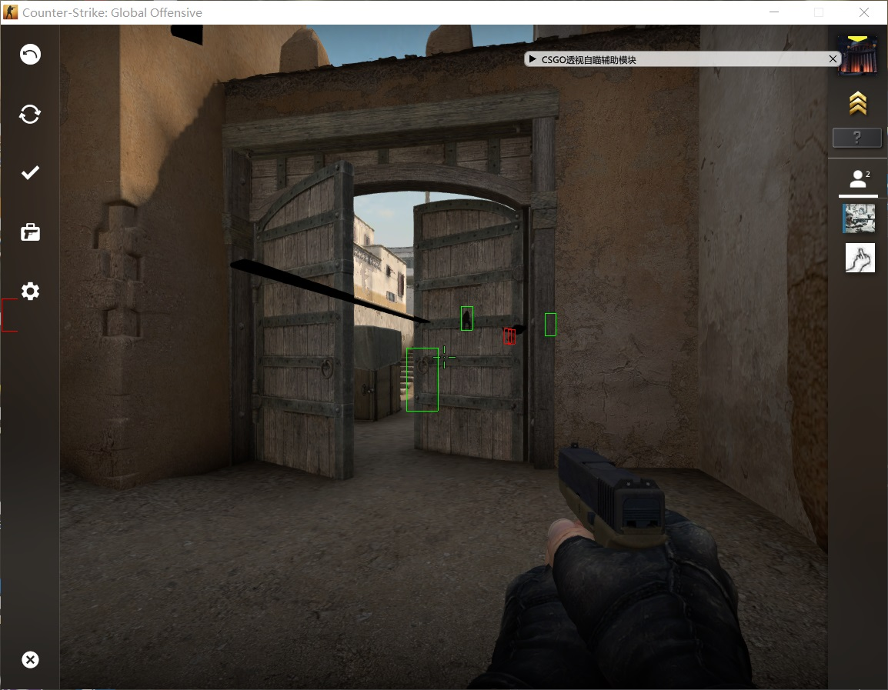
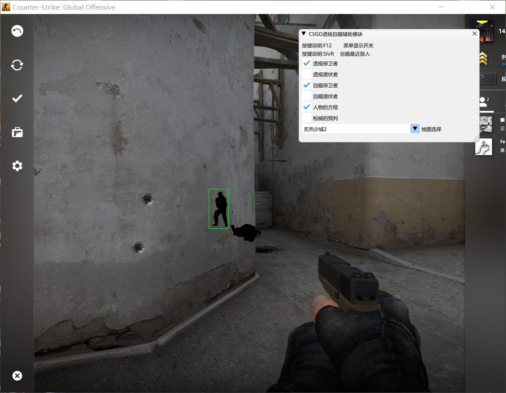
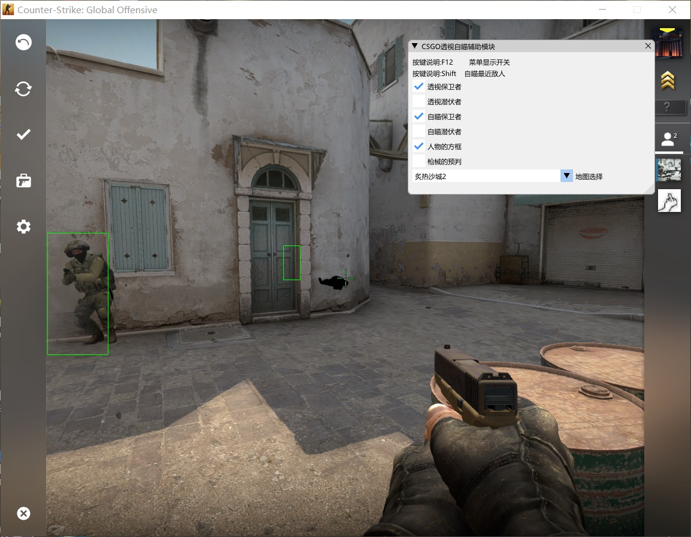
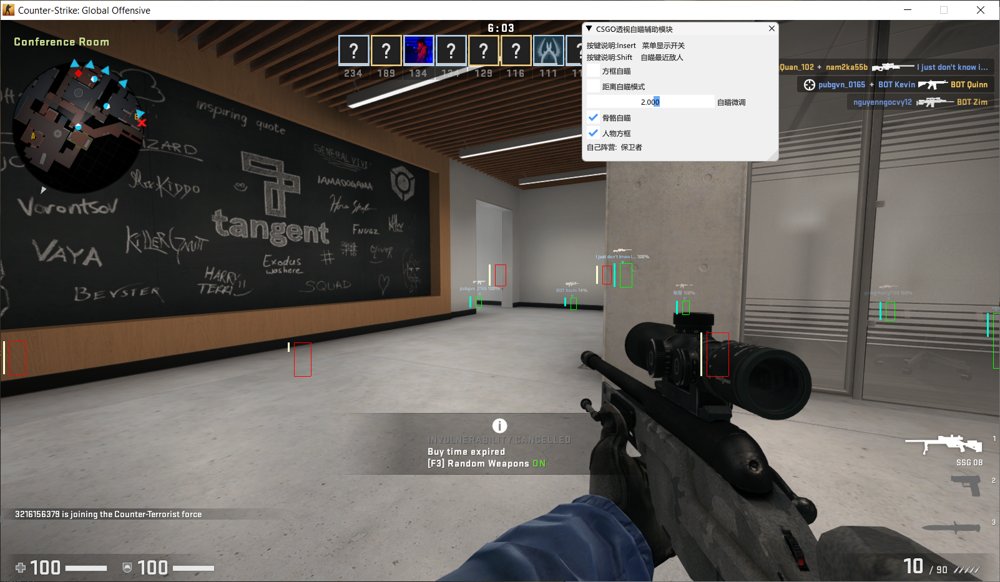
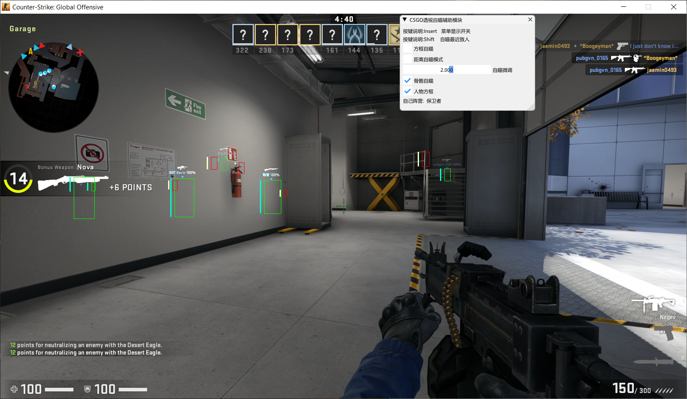

# 效果图
<h1 align="center">
	
	
	
	
	
	
	 
	 
</h1>

效果视频地址：
https://v.youku.com/v_show/id_XNDQwOTcxNDYxNg==.html?spm=a2h3j.8428770.3416059.1

使用方法:
使用DLL注入工具将DLL文件注入游戏进程
建议选择【人物方框】和【骨骼自瞄】
按键【Shitf】为自瞄按键
自瞄微调越大准星越往下，2.00为瞄准头部

编译方法：
下载源码，设置为X86，Release或者Debug版本都行

!!!!因为都是使用游戏绝对地址，所以游戏更新后就要替换地址才能有效。

给一个大佬的CSGOHack：https://github.com/danielkrupinski/Osiris，一个非常完善的Hack，大家可以去看看。

