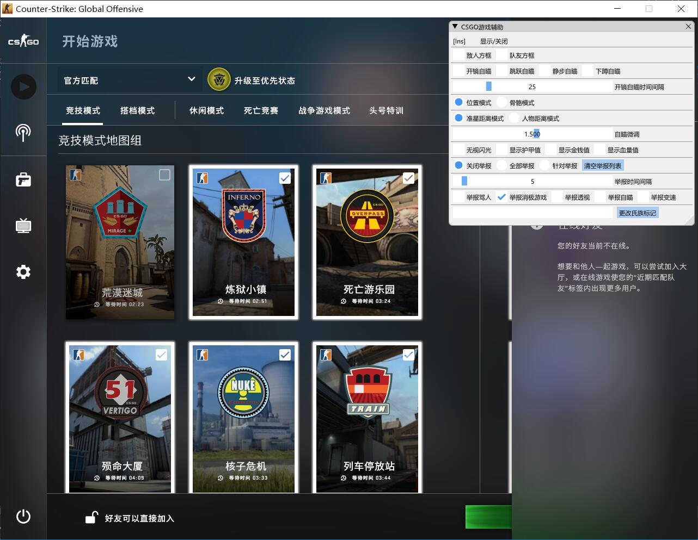

# 效果图
<h1 align="center">
	
	 
</h1>

## 编译方法:

### Prerequisites
下载微软VS2017尝试编译(Release  x86  dll)

## 使用方法:

### Prerequisites
用任意DLL注入工具对CSGO游戏进程执行注入操作

## 当前辅助功能

### Prerequisites
1.能显示[敌人方框]和[队友方框].

2.支持[开镜自瞄] [跳跃自瞄] [静步自瞄] [下蹲自瞄]，使用开镜自瞄会开镜的时候进行开枪操作，建议使用连狙的时候使用，可以设置[开镜自瞄时间间隔]以减少后座力，这四个自瞄模式应该是[静步自瞄]最好用.

3.[位置模式]不能处理敌人下蹲操作，所以建议用[骨骼模式]!!!.

4.[准星距离模式]：哪个敌人距离准星近就瞄准哪个.
[人物距离模式]:哪个敌人距离自己位置近就瞄准哪个.

5.[自瞄微调]默认瞄准头部，数值越大自瞄位置越向敌人身体.

6.加入了举报功能!!!遇到同行打不过？？举报咯。使用[针对举报]会新弹出一个对话框，选择对应人物的ID就能不断举报该玩家.

## 缺点

### Prerequisites
注意！！！！不是每一个人都能使用这个辅助的，因为该辅助里面的数据基址都是我用硬编码写进去的，没有全部都使用内存模式匹配，所以内这个辅助相对脆弱，游戏更新一次或许就不能用了，要重新找到数据基址进行更改才能继续使用，所以有一点开发辅助的人才能使用，当然我和代码一起上传的还有我的CSGO修改笔记.txt文件，里面的东西对查找新的数据基址有所帮助。

## 最后

### Prerequisites
本人不是专门写辅助的，CSGO也是无聊一玩，有时间的话再考虑加入新的功能

